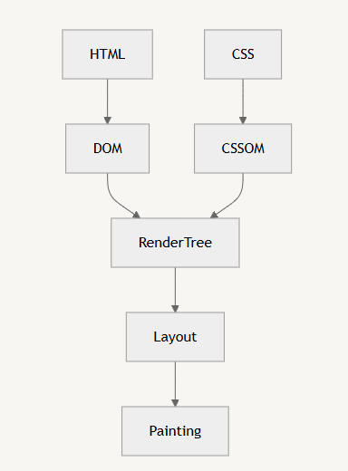

# [한입 리액트] React.js 개론

## React.js 개론

### **React의 기술적 특징**

1. **컴포넌트 기반 UI**
    - UI를 작은 컴포넌트 단위로 나누어 개발할 수 있음.
    - 모듈화된 구조로, 유지보수가 쉽고 재사용성이 높음.
2. **화면 업데이트 구현이 용이**
    - 선언형 프로그래밍 방식으로 UI 업데이트를 간단히 구현할 수 있음.
3. **빠른 화면 업데이트**
    - Virtual DOM을 활용해 효율적으로 변경 사항을 처리함.

### **컴포넌트의 장점**

- **코드 중복 제거**
    - 헤더, 메인, 푸터같은 요소들을 각각 `Header.js`, `Main.js`, `Footer.js`로 분리해 작성 가능.
    - 중복 코드를 줄이고, 수정 사항 발생 시 해당 컴포넌트만 변경하면 되어 유지보수가 용이함.
- **재사용성**
    - 여러 페이지에서 동일한 컴포넌트를 불러와 사용할 수 있음.

### **React의 화면 업데이트**

React는 선언형 프로그래밍 방식을 사용하여, 사용자의 행동(클릭, 드래그 등)에 따라 간단히 화면을 업데이트함.

### **선언형 vs 목적형 프로그래밍**

- **선언형 프로그래밍**
    - "무엇을 하고 싶은지"만 명시.
    - 코드가 간결하며 읽기 쉽다.
    - 예) "토마토 파스타 하나 주세요."
- **목적형 프로그래밍**
    - 목적을 이루기 위한 모든 과정을 상세히 기술.
    - 코드가 복잡하고 길다.
    - 예) “주방으로 가셔서 면 100g을 꺼내세요. 그리고 뜨거운 물에 9분간 삶으세요. 어쩌고저쩌고 . . . .”

### **State와 UI 렌더링**

- 각 컴포넌트는 **state**라는 변수에 현재 상태를 저장함.
- **state 값이 변경되면, React는 변경된 값을 기준으로 UI를 다시 렌더링**.
- 개발자는 UI 업데이트를 위해 복잡한 동작을 직접 정의할 필요 없이, state 값을 변경하는 것만으로 간단히 구현 가능.

### **브라우저 렌더링 과정과 Virtual DOM**



- **DOM (Document Object Model)**
    - HTML 문서를 트리 구조로 표현한 객체 모델.
- **CSSOM (CSS Object Model)**
    - CSS 스타일을 트리 구조로 표현한 객체 모델.

**DOM과 CSSOM**을 결합해 **Render Tree**를 생성하고, 이후 **Layout**(배치 계산)과 **Painting**(화면에 그림 그리기) 과정을 거쳐 최종적으로 화면에 렌더링함.

### **React의 Virtual DOM**

- **Virtual DOM**: 실제 DOM을 자바스크립트 객체로 흉내 낸 복제판.
- 여러 업데이트가 동시에 발생할 경우, React는 이를 Virtual DOM에서 처리한 후, 변경 사항을 한 번에 Actual DOM에 반영.
- **효율적인 DOM 업데이트**로 ReFlow와 RePainting 횟수를 줄여 성능 저하를 방지한다.

## React App 생성

1. Node.js 패키지 생성
2. React 라이브러리 설치
3. 기타 도구 설치 및 설정
    
    ⇒ Vite를 사용하면 기본 설정이 적용된 React App 생성이 가능
    

### Vite로 React App 생성하고 실행하기

```bash
$ npm create vite@latest

> npx
> create-vite

√ Project name: ... section04
√ Select a framework: » React
√ Select a variant: » JavaScript
```

```bash
$ npm i

added 249 packages, and audited 250 packages in 15s

102 packages are looking for funding
  run `npm fund` for details

found 0 vulnerabilities
```

```bash
$ npm run dev

> section04@0.0.0 dev
> vite

  VITE v6.0.3  ready in 276 ms

  ➜  Local:   http://localhost:5173/
  ➜  Network: use --host to expose
  ➜  press h + enter to show help
```

### 디렉토리 구조

```
/ 프로젝트 루트
  ├── node_modules/      // 프로젝트 의존성 라이브러리
  ├── public/            // 정적 파일 보관 디렉토리
  │   └── vite.svg       // 정적 이미지 파일
  ├── src/               // React 소스 코드 디렉토리
  │   ├── assets/        // 이미지, 폰트 등 정적 파일
  │   ├── App.jsx        // 메인 컴포넌트
  │   ├── main.jsx       // ReactDOM으로 App 컴포넌트를 렌더링
  │   ├── components/    // 재사용 가능한 컴포넌트 모음
  │   ├── styles/        // CSS 파일
  │   └── index.css      // 전역 스타일 정의
  ├── .gitignore         // Git에서 무시할 파일/디렉토리 설정
  ├── eslint.config.js   // ESLint 설정 파일
  ├── index.html         // React의 초기 HTML 파일 (엔트리 포인트)
  ├── package.json       // 프로젝트 메타정보 및 의존성 목록
  ├── package-lock.json  // 의존성 버전 고정 파일
  ├── README.md          // 프로젝트 설명 문서
  └── vite.config.js     // Vite 설정 파일

```

## React App 구동원리

React 앱은 내장된 Web Server를 `npm run dev` 명령어를 통해 가동하여 실행된다.

### 서버 접속

- `http://localhost:5173/` : 현재 가동중인 리액트 웹 서버에 접속할 수 있는 주소
    - `localhost`: 내 컴퓨터의 주소를 의미
    - `5173`: 포트 번호를 의미

### 연결 과정

1. `index.html`
    - React 컴포넌트가 렌더링되는 `<div id="root"></div>`가 포함되어 있다.
    - `main.jsx`를 `<script>`로 불러온다.
2. `main.jsx`
    - ReactDOM을 사용해 `App.jsx` 컴포넌트를 `index.html`의 `<div id="root">`안에 렌더링한다.
    
    ```jsx
    import { StrictMode } from 'react'
    import { createRoot } from 'react-dom/client'
    import './index.css'
    import App from './App.jsx'
    
    createRoot(document.getElementById('root')).render(
      <StrictMode>
        <App />
      </StrictMode>,
    )
    ```
    
    - `main.jsx`에서 `createRoot`가 호출되어 `index.html`의 `<div id="root">`를 React의 루트로 설정.
    - 이후, React 컴포넌트(App.jsx)들이 이 루트 아래로 렌더링됨.
3. `App.jsx`
    - 애플리케이션의 메인 컴포넌트
    - HTML 구조와 React 컴포넌트를 정의한다.
    - 여기서 작성된 jsx 코드가 ReactDOM에 의해 실제 DOM에 렌더링된다.